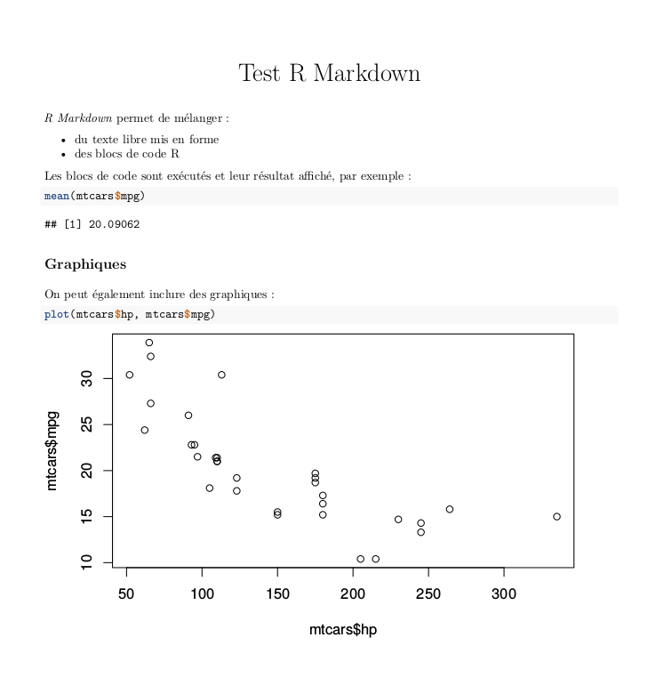
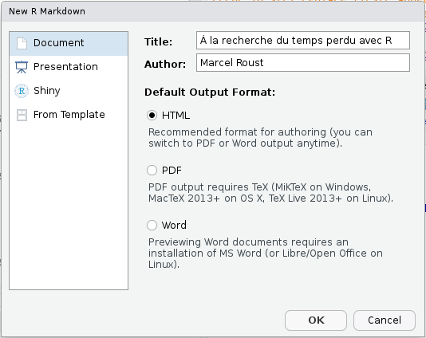

# Diffuser et publier des rapports automatisés avec  `rmarkdown` {#rmarkdown}

Ce chapitre est extrait du cours de Julien Barnier "Introduction à R et au tidyverse" (https://juba.github.io/tidyverse)

L'extension `rmarkdown` permet de générer des documents de manière dynamique en mélangeant texte mis en forme et résultats produits par du code R. Les documents générés peuvent être au format HTML, PDF, Word. C'est donc un outil très pratique pour l'exportation, la communication et la diffusion de résultats d'analyse.

Le présent document a lui-même été généré à partir de fichiers R Markdown.

`rmarkdown` ne fait pas partie du *tidyverse*, mais elle est installée et chargée par défaut par RStudio^[Si vous n'utilisez pas ce dernier, l'extension peut être installée à part avec `install.packages("rmarkdown")` et chargée explicitement avec 
`library(rmarkdown)`.].

Voici un exemple de document R Markdown minimal :

Ce document peut être "compilé" sous différents formats. Lors de cette étape, le texte est mis en forme, les blocs de code sont exécutés, leur résultat ajouté au document, et le tout est transformé dans un des différents formats possibles.


Voici le rendu du document précédent au format HTML :

<p>

</p>


Le rendu du même document au format PDF :
<p>

</p> 


Et le rendu au format `docx` :
<p>

</p>

Les avantages de ce système sont nombreux :

- le code et ses résultats ne sont pas séparés des commentaires qui leur sont associés
- le document final est reproductible
- le document peut être très facilement régénéré et mis à jour, par exemple si les données source ont été modifiées.


## Créer un nouveau document

Un document R Markdown est un simple fichier texte enregistré avec l'extension `.Rmd`.

Sous RStudio, on peut créer un nouveau document en allant dans le menu *File* puis en choisissant *New file* puis *R Markdown...*. La boîte de dialogue suivante s'affiche :

<p>

</p>

On peut indiquer le titre, l'auteur du document ainsi que le format de sortie par défaut (il est possible de modifier facilement ces éléments par la suite). 
Un fichier comportant un contenu d'exemple s'affiche alors. Vous pouvez l'enregistrer où vous le souhaitez avec une extension `.Rmd`.


## Éléments d'un document R Markdown


### En-tête (préambule)

La première partie du document est son *en-tête*. Il se situe en tout début de document, et est délimité par trois tirets (`---`) avant et après :

    ---
    title: "Titre"
    author: "Prénom Nom"
    date: "10 avril 2017"
    output: html_document
    ---

Cet en-tête contient les métadonnées du document, comme son titre, son auteur, sa date, plus tout un tas d'options possibles qui vont permettre de configurer ou personnaliser l'ensemble du document et son rendu. Ici, par exemple, la ligne `output: html_document` indique que le document généré doit être au format HTML.


### Texte du document

Le corps du document est constitué de texte qui suit la syntaxe *Markdown*. Un fichier Markdown est un fichier texte contenant un balisage léger qui permet de définir des niveaux de titres ou de mettre en forme le texte. Par exemple, le texte suivant :

    Ceci est du texte avec *de l'italique* et **du gras**.
    
    On peut définir des listes à puces :
    
    - premier élément
    - deuxième élément
    
Génèrera le texte mis en forme suivant :    
    
> Ceci est du texte avec de l'*italique* et du **gras**.
>
> On peut définir des listes à puces :
>  
> - premier élément
> - deuxième élément

On voit que des mots placés entre des astérisques sont mis en italique, des lignes qui commencent par un tiret sont transformés en liste à puce, etc.

On peut définir des titres de différents niveaux en faisant débuter une ligne par un ou plusieurs `#` :

```
# Titre de niveau 1
## Titre de niveau 2
### Titre de niveau 3
```

Quand des titres ont été définis, si vous cliquez sur l'icône *Show document outline* totalement à droite de la barre d'outils associée au fichier R Markdown, une table des matières générée automatiquement à partir des titres s'affiche et vous permet de naviguer facilement dans le document :

<p>

</p>


La syntaxe Markdown permet d'autres mises en forme, comme la possibilité d'insérer des liens ou des images. Par exemple, le code suivant :

    [Exemple de lien](https://example.com)

Donnera le lien suivant :

> [Exemple de lien](https://example.com)

Dans RStudio, le menu *Help* puis *Markdown quick reference* donne un aperçu plus complet de la syntaxe.

### Blocs de code R

En plus du texte libre au format Markdown, un document R Markdown contient, comme son nom l'indique, du code R. Celui-ci est inclus dans des blocs (*chunks*) délimités par la syntaxe suivante.
Comme cette suite de caractères n'est pas très simple à saisir, vous pouvez utiliser le menu *Insert* de RStudio et choisir *R*^[Il est possible d'inclure dans un document R Markdown des blocs de code d'autres langages], ou utiliser le raccourci clavier `Ctrl+Alt+i`.

<p>

</p>

Dans RStudio les blocs de code R sont en général affichés avec une couleur de fond légèrement différente pour les distinguer du reste du document.

Quand votre curseur se trouve dans un bloc, vous pouvez saisir le code R que vous souhaitez, l'exécuter, utiliser l'autocomplétion, exactement comme si vous vous trouviez dans un script R. Vous pouvez également exécuter l'ensemble du code contenu dans un bloc à l'aide du raccourci clavier `Ctrl+Maj+Entrée`.

Dans RStudio, par défaut, les résultats d'un bloc de code (texte, tableau ou graphique) s'affichent directement *dans* la fenêtre d'édition du document, permettant de les visualiser facilement et de les conserver le temps de la session ^[Ce comportement peut être modifié en cliquant sur l'icône d'engrenage de la barre d'outils et en choisissant *Chunk Output in Console*].

Lorsque le document est "compilé" au format HTML, PDF ou docx, chaque bloc est exécuté tour à tour, et le résultat inclus dans le document final, qu'il s'agisse de texte, d'un tableau ou d'un graphique. Les blocs sont liés entre eux, dans le sens où les données importées ou calculées dans un bloc sont accessibles aux blocs suivants. On peut donc aussi voir un document R Markdown comme un script R dans lequel on aurait intercalé du texte libre au format Markdown.

À noter qu'avant chaque compilation, une nouvelle session R est lancée, ne contenant aucun objet. Les premiers blocs de code d'un document sont donc souvent utilisés pour importer des données, exécuter des recodages, etc.


### Compiler un document (*Knit*)

On peut à tout moment compiler, ou plutôt "tricoter" (*Knit*), un document R Markdown pour obtenir et visualiser le document généré. Pour cela, il suffit de cliquer sur le bouton *Knit* et de choisir le format de sortie voulu :

<p>

</p>

Vous pouvez aussi utiliser le raccourci `Ctrl+Maj+K` pour compiler le document dans le dernier format utilisé.


Pour la génération du format PDF, vous devez avoir une installation fonctionnelle de `LaTeX` sur votre système.
Si ça n'est pas le cas, l'extension `tinytex` de Yihui Xie vise à faciliter l'installation d'une distribution `LaTeX` minimale quel que soit le système d'exploitation de votre machine. Pour l'utiliser il vous faut d'abord installer l'extension avec `install.packages('tinytex')`, puis lancer la commande suivante dans la console (prévoir un téléchargement d'environ 200Mo) :
`tinytex::install_tinytex()`
Plus d'informations sur [le site de tinytex](https://yihui.name/tinytex/).


Un onglet *R Markdown* s'ouvre dans la même zone que l'onglet *Console* et indique la progression de la compilation, ainsi que les messages d'erreur éventuels. Si tout se passe bien, Le document devrait s'afficher soit dans une fenêtre *Viewer* de RStudio (pour la sortie HTML), soit dans le logiciel par défaut de votre ordinateur.

## Personnaliser le document généré

La personnalisation du document généré se fait en modifiant des options dans le préambule du document. RStudio propose néanmoins une petite interface graphique permettant de changer ces options plus facilement. Pour cela, cliquez sur l'icône en forme d'engrenage à droite du bouton *Knit* et choisissez *Output Options...*

<p>

</p>

Une boîte de dialogue s'affiche vous permettant de sélectionner le format de sortie souhaité et, selon le format, différentes options :

<p>

</p>

Pour le format HTML par exemple, l'onglet *General* vous permet de spécifier si vous voulez une table des matières, sa profondeur, les thèmes à appliquer pour le document et la coloration syntaxique des blocs R, etc. L'onglet *Figures* vous permet de changer les dimensions par défaut des graphiques générés.

Une option très intéressante pour les fichiers HTML, accessible via l'onglet *Advanced*, est l'entrée *Create standalone HTML document*. Si elle est cochée (ce qui est le cas par défaut), le document HTML généré contiendra en un seul fichier le code HTML mais aussi les images et toutes les autres ressources nécessaires à son affichage. Ceci permet de générer des fichiers (parfois assez volumineux) que vous pouvez transférer très facilement à quelqu'un par mail ou en le mettant en ligne quelque part. Si la case n'est pas cochée, les images et autres ressources sont placées dans un dossier à part.

Lorsque vous changez des options, RStudio va en fait modifier le préambule de votre document. Ainsi, si vous choisissez d'afficher une table des matières et de modifier le thème de coloration syntaxique, votre en-tête va devenir quelque chose comme :

    ---
    title: "Test R Markdown"
    output:
       html_document: 
         highlight: kate
         toc: yes
    ---

Vous pouvez modifier les options directement en éditant le préambule. 

À noter qu'il est possible de spécifier des options différentes selon les formats, par exemple :

    ---
    title: "Test R Markdown"
    output:
      html_document: 
        highlight: kate
        toc: yes
      pdf_document: 
        fig_caption: yes
        highlight: kate
    ---

La liste complète des options possibles est présente sur [le site de la documentation officielle](http://rmarkdown.rstudio.com/formats.html) (très complet et bien fait) et sur l'antisèche et le guide de référence, accessibles depuis RStudio via le menu *Help* puis *Cheatsheets*.


## Options des blocs de code R

Il est également possible de passer des options à chaque bloc de code R pour modifier son comportement.

On rappelle qu'on bloc de code se présente de la manière suivante :

```{r echo = FALSE, comment = ""}
cat(htmltools::includeText("./img/code_chunk.Rmd"))
```

Les options d'un bloc de code sont à placer à l'intérieur des accolades `{r}`.

### Nom du bloc

La première possibilité est de donner un *nom* au bloc. Celui-ci est indiqué directement après le `r` :

`{r nom_du_bloc}`

Il n'est pas obligatoire de nommer un bloc, mais cela peut être utile en cas d'erreur à la compilation, pour identifier le bloc ayant causé le problème. Attention, on ne peut pas avoir deux blocs avec le même nom.

### Options

En plus d'un nom, on peut passer à un bloc une série d'options sous la forme `option = valeur`. Voici un exemple de bloc avec un nom et des options :

```{r echo = FALSE, comment = ""}
cat(htmltools::includeText("./img/code_chunk_name_options.Rmd"))
```

Et un exemple de bloc non nommé avec des options :

```{r echo = FALSE, comment = ""}
cat(htmltools::includeText("./img/code_chunk_noname_options.Rmd"))
```

Une des options la plus utile est l'option `echo`. Par défaut `echo` vaut `TRUE`, et le bloc de code R est inséré dans le document généré, de cette manière : 

```{r}
x <- 1:5
print(x)
```

Mais si on positionne l'option `echo=FALSE`, alors le code R n'est plus inséré dans le document, et seul le résultat est visible :

```{r echo=FALSE}
x <- 1:5
print(x)
```

Voici une liste de quelques-unes des options disponibles :

<p>

</p>

Il existe de nombreuses autres options décrites notamment dans [guide de référence R Markdown](https://www.rstudio.com/wp-content/uploads/2015/03/rmarkdown-reference.pdf) (PDF en anglais).


### Modifier les options

Il est possible de modifier les options manuellement en éditant l'en-tête du bloc de code, mais on peut aussi utiliser une petite interface graphique proposée par RStudio. Pour cela, il suffit de cliquer sur l'icône d'engrenage située à droite sur la ligne de l'en-tête de chaque bloc :

<p>

</p>

Vous pouvez ensuite modifier les options les plus courantes, et cliquer sur *Apply* pour les appliquer.


### Options globales

On peut vouloir appliquer une option à l'ensemble des blocs d'un document. Par exemple, on peut souhaiter par défaut ne pas afficher le code R de chaque bloc dans le document final.

On peut positionner une option globalement en utilisant la fonction `knitr::opts_chunk$set()`.
Par exemple, insérer `knitr::opts_chunk$set(echo = FALSE)` dans un bloc de code positionnera l'option `echo = FALSE` par défaut pour tous les blocs suivants.

En général, on place toutes ces modifications globales dans un bloc spécial nommé `setup` et qui est le premier bloc du document :

```{r echo=FALSE, comment=""}
cat(htmltools::includeText("./img/setup_chunk.Rmd"))
```


Par défaut RStudio exécute systématiquement le contenu du bloc `setup` avant d'exécuter celui d'un autre bloc.

Contrairement aux autres blocs de code, quand on utilise dans RStudio le menu des paramètres du bloc `setup` pour modifier ses options, celles-ci modifient non pas les options de ce bloc mais les options globales, en mettant à jour l'appel de la fonction `knitr::opts_chunk$set()`.

### Mise en cache des résultats

Compiler un document R Markdown peut être long, car il faut à chaque fois exécuter l'ensemble des blocs de code R qui le constituent.

Pour accélérer cette opération, R Markdown utilise un système de *mise en cache* : les résultats de chaque bloc sont enregistrés dans un fichier et à la prochaine compilation, si le code et les options du bloc n'ont pas été modifiés, c'est le contenu du fichier de cache qui est utilisé, ce qui évite d'exécuter le code R.

On peut activer ou désactiver la mise en cache des résultats pour chaque bloc de code avec l'option `cache = TRUE` ou `cache = FALSE`, et on peut aussi désactiver totalement la mise en cache pour le document en ajoutant `knitr::opts_chunk$set(cache = FALSE)` dans le premier bloc *setup*.


Ce système de cache peut poser problème par exemple si les données source changent : dans ce cas les résultats de certains blocs peuvent ne pas être mis à jour s'ils sont présents en cache. Dans ce cas, on peut vider le cache du document, ce qui forcera un recalcul de tous les blocs de code à la prochaine compilation. Pour cela, vous pouvez ouvrir le menu *Knit* et choisir *Clear Knitr Cache...* :

<p>

</p>

## Rendu des tableaux

### Tableaux croisés

Par défaut, les tableaux issus de la fonction `table` sont affichés comme ils apparaissent dans la console de R, en texte brut :

```{r}
library(questionr)
data(hdv2003)
tab <- lprop(table(hdv2003$qualif, hdv2003$sexe))
tab
```

On peut améliorer leur présentation en utilisant la fonction `kable` de l'extension `knitr`. Celle-ci fournit un formatage adapté en fonction du format de sortie. On aura donc des tableaux "propres" que ce soit en HTML, PDF ou aux formats traitements de texte :

```{r}
library(knitr)
kable(tab)
```

Différents arguments permettent de modifier la sortie de `kable`. `digits`, par exemple, permet de spécifier le nombre de chiffres significatifs à afficher dans les colonnes de nombres :

```{r}
kable(tab, digits = 1)
```
